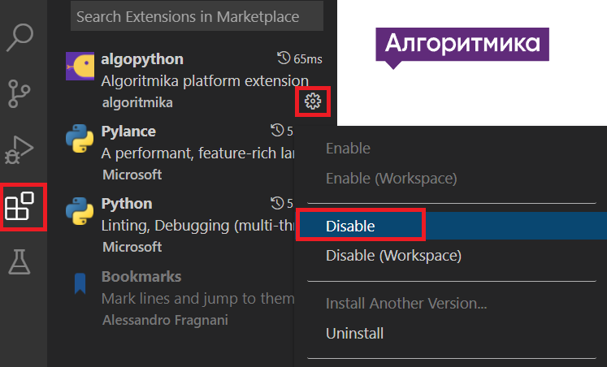

# Установка
## Windows

1. Убираем расширение algoritmika
   


Запускаем **powershell** с правами администратора:


1. Устанавливаем chocolotey

```sh
Set-ExecutionPolicy Bypass -Scope Process -Force; [System.Net.ServicePointManager]::SecurityProtocol = [System.Net.ServicePointManager]::SecurityProtocol -bor 3072; iex ((New-Object System.Net.WebClient).DownloadString('https://community.chocolatey.org/install.ps1'))
```

1. Устанавливаем python
```sh
choco install -y python
```
1. Устанавливаем telebot
```sh
pip install -y pyTelegramBotAPI
```

## MAC OS

1. Убираем расширение algoritmika
   


2. Устанавливаем **brew**
```sh
/bin/bash -c "$(curl -fsSL https://raw.githubusercontent.com/Homebrew/install/HEAD/install.sh)"
```

3. Устанавливаем python
```sh
brew install python
```
4. Устанавливаем telebot
```sh
pip3 install -y pyTelegramBotAPI
```